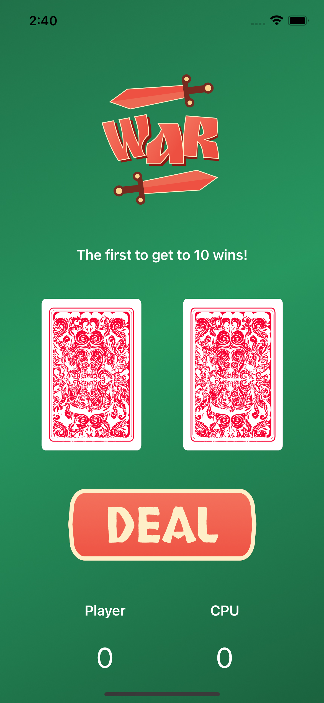

# War Card Game

This is a simple iOS Application made using SwiftUI that randomly generates two cards for the player and the CPU.
Whoever has a higher card, gets 1 point, and once either player or the CPU reaches 10 points, the game resets.

Here are a few screenshots of the game:

  
  

All the images used in this app are in the folder: "War Card Game Image Assets"

The source XCode Project file is in the path: "War Card Game/War Card Game.xcodeproj" 
